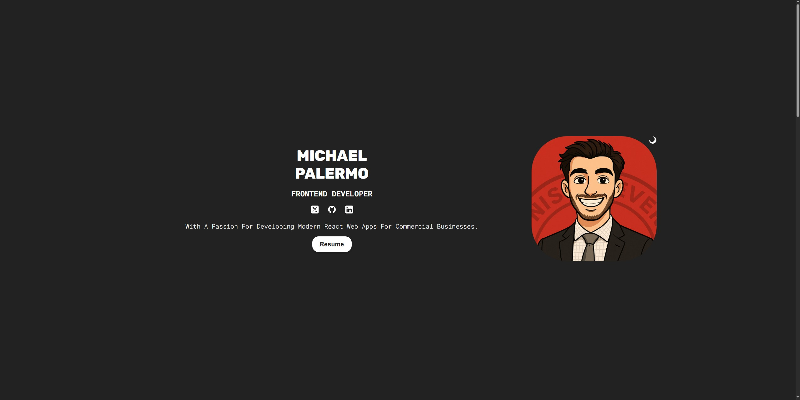

# 💼 My Developer Portfolio

This is my personal developer portfolio built with **React**. It showcases my skills, experience, and selected projects in a clean, responsive design.

## 🚀 Features

- Built with React and modern JavaScript (ES6+)
- Responsive design for desktop, tablet, and mobile
- Project showcase with links to GitHub and live demos
- About, Skills, and Contact sections
- Smooth scrolling and animation effects

## 🛠 Tech Stack

- **React**
- **JavaScript (ES6+)**
- **HTML5 & CSS3**
- **Tailwind CSS** *(or your CSS framework)*
- **React Router** *(optional)*
- **EmailJS / AWS SES / Formspree** for contact form

## 📸 Screenshots

  
  
  
